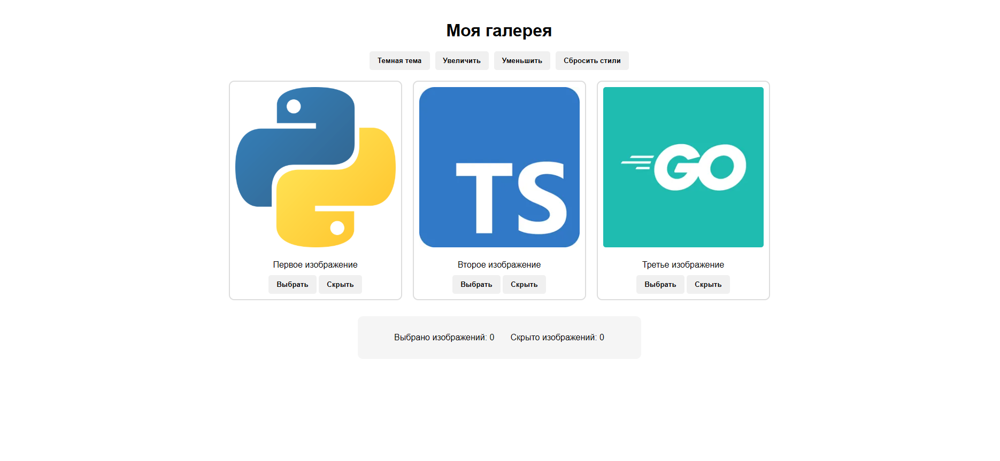
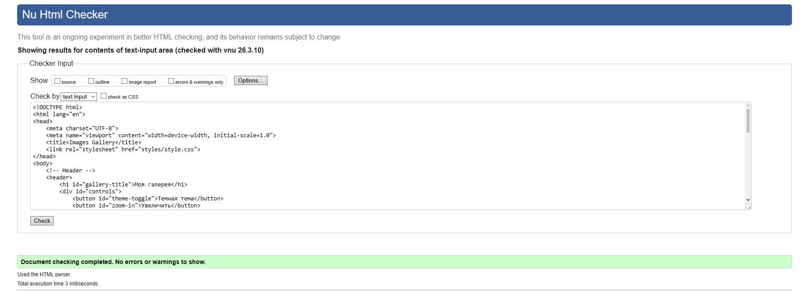
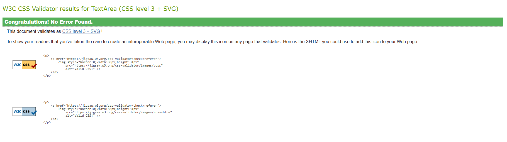

# ImageGallery
This is the learning project working with DOM elements in JavaScript.
 

## Development goal
Creating an interactive web application for managing images using
JavaScript (ES6+).

## Launch
Run locally using [LiveServer](https://github.com/ritwickdey/vscode-live-server) on localhost:5500

## Validations
### HTML

### CSS
